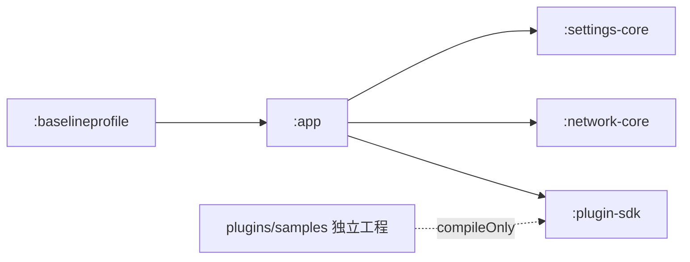
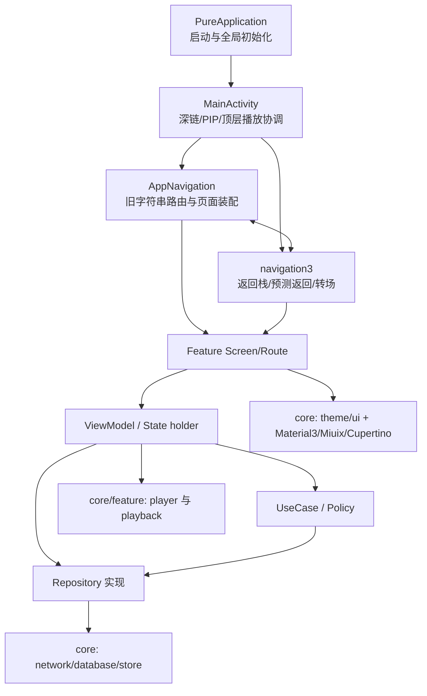
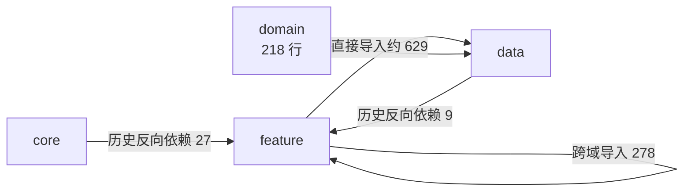
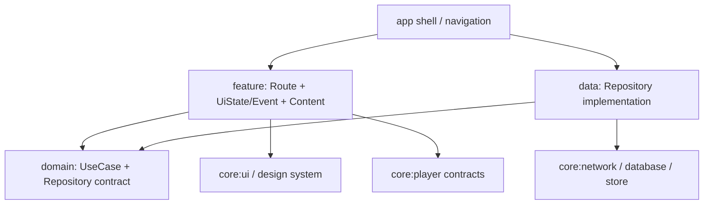

# 架构说明

最后更新：2026-07-25（按 `main` 分支 `42cb9c0b` 校对）

本页描述当前真实结构、主要依赖问题和渐进目标。目录名称只表达意图，实际依赖以源码导入和 Gradle 配置为准。

## 工程规模

| 范围 | Kotlin 文件 | 约行数 | 说明 |
| --- | ---: | ---: | --- |
| `app/src/main` | 1,016 | 约 30 万 | 主应用、业务、UI、播放器和数据实现 |
| `core` | 190 | 约 3.7 万 | UI、设置、网络、数据库、播放器等公共能力 |
| `data` | 80 | 约 1.9 万 | Model 与 Repository 实现 |
| `domain` | 2 | 约 200 | 当前仅少量 UseCase，尚未形成稳定契约层 |
| `feature` | 696 | 约 22.3 万 | 主要业务和 UI，约占主源码四分之三 |
| `navigation + navigation3` | 35 | 约 7,300 | 旧路由编排与 Navigation 3 过渡层 |

## Gradle 模块



- `:app`：几乎全部产品代码。
- `:settings-core`：少量可复用设置策略。
- `:network-core`：网络回退与匿名化策略。
- `:plugin-sdk`：相对稳定的插件契约，可独立发布。
- `:baselineprofile`：启动、首页、视频详情等性能场景。

当前不是“缺少模块所以无法维护”，而是模块化之前的包依赖还没有稳定。不要先创建一批空 Feature 模块。

## 当前运行链路



这张图包含当前的直接依赖。理想情况下 ViewModel 只依赖 Domain 契约，但目前大量 Feature 仍直接调用 Repository 和 `SettingsManager`。

## 当前依赖热点

2026-07-25 对主源码的静态导入扫描结果：

- `feature -> core`：约 2,026 条导入。
- `feature -> data`：约 629 条导入。
- 跨 Feature：278 条导入，涉及 89 个文件和 58 组方向。
- `core -> feature`：27 条导入，集中在 `Theme.kt`、`SettingsManager.kt`、`ComfortablePullToRefreshBox.kt`。
- `data -> feature`：9 条导入，集中在文章、字幕、PBP 进度和竖屏播放策略。
- 规模最大的交叉方向包括 `bangumi -> video`、`dynamic <-> video`、`live -> video`、`partition -> home`。



这些数字用于确定治理顺序，不代表需要一次性消灭所有导入。播放器本身就是跨功能能力，先明确契约所有权比批量移动文件更重要。

## 目标依赖关系



约束：

- Domain 不依赖 Android UI、Feature 或 Data 实现。
- Core 不依赖 Feature。
- Feature 之间不复用页面、ViewModel 或 UI 状态；共享契约下沉。
- `Screen/Route` 负责收集状态和平台副作用，`Content` 只消费不可变状态与事件。
- Gradle 模块只在包边界已经稳定、可以独立编译测试后创建。

## 渐进治理顺序

1. **先清理反向依赖**：把主题、设置、截图、字幕等持久化枚举从 Feature 移到 `core/store` 或 Domain 契约。
2. **建立共享播放契约**：让番剧、直播、音频、下载依赖稳定的播放器接口，而不是 `feature/video` 的页面实现。
3. **按页面拆状态边界**：新 UI 采用 `Route -> UiState/Event -> Content`，为 Preview 和截图测试提供纯渲染入口。
4. **收敛导航桥接**：保留行为，逐项把旧字符串路由映射到 Navigation 3，不与 UI 重写同时大改。
5. **最后评估模块化**：优先考虑稳定的 Design System、Model/Domain、Network/Data 和 Player，不先拆 `video`。

## 架构快照

运行以下命令会在 `build/reports/architecture/architecture-snapshot.md` 生成当前规模、顶层依赖和跨 Feature 热点：

```powershell
powershell -ExecutionPolicy Bypass -File scripts/architecture_snapshot.ps1
```

该报告是辅助快照，不替代编译、测试或人工判断。当前仓库没有初始化 CodeGraph；需要更深的调用链分析时再单独建立索引。

## UI 验证

UI 重构前先使用 [UI 验证环境](UI_VALIDATION.md) 建立 Preview、Debug 验证台和真机截图基线。这样架构整理与视觉改动可以分别验证。
