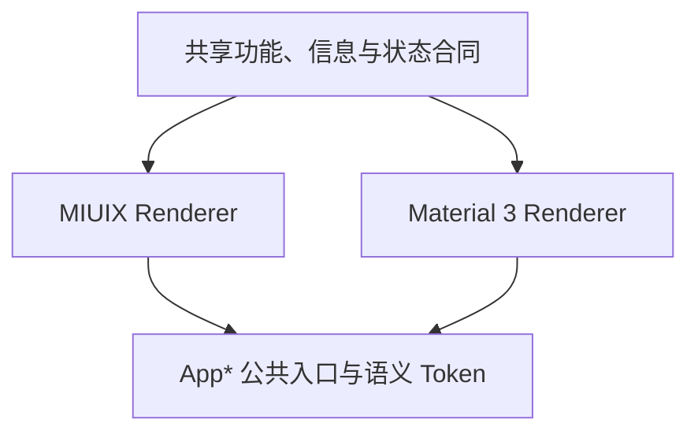

# 01 设计方向

> 文档编号：UI-01<br>
> 规范版本：1.1.0-draft<br>
> 状态：草案<br>
> 最后核对日期：2026-08-10<br>
> 适用提交：146819292<br>
> 维护角色：设计系统维护者<br>
> 相关文档：[主题规范](03_THEMES.md) · [设置页档案](pages/SETTINGS.md) · [设置页 UI 优化计划](12_SETTINGS_UI_OPTIMIZATION_PLAN.md)

## 初学者解释

BiliPai 只有一套产品信息架构，但允许 MIUIX 与 Material 3 使用各自熟悉的视觉语法。它们像同一份内容的两种规范排版：设置名称、顺序、状态和结果必须相同；顶部栏、分组卡、图标、圆角、动效和控件实现可以不同。iOS 仅是历史设置迁移来源，不再是运行时主题。

## What：设计目标

BiliPai 是内容浏览和媒体播放工具，界面应该安静、清晰、适合反复操作。目标优先级如下：

1. 用户能快速识别当前内容、状态和可执行操作。
2. 加载、失败、权限、登录与播放状态诚实可见。
3. 手机、平板和宽屏保持同一信息顺序与返回语义。
4. MIUIX 作为默认主题，完整遵循小米系统式组件节奏。
5. Material 3 作为对等可选主题，遵循 Material 组件和角色体系，而不是给 MIUIX 组件换色。
6. 动效和玻璃效果服务于层级反馈，不能牺牲可读性、密度与性能。

## Why：为什么这样选择

- 项目已经接入 Miuix，并已有主题桥接、Preference、导航栏、侧栏和播放器设置能力。
- 运行时已收敛为 `AppUiStyle.MIUIX` 与 `AppUiStyle.MATERIAL3`，继续维护第三套页面只会制造状态分叉。
- 设置页属于高频操作界面，首先需要可扫读、可预测和状态清楚，而不是展示所有可配置的设计细节。
- 官方产品的共同规律不是像素相同，而是用分组、留白、稳定行结构和原生控件降低理解成本。

## 参考风格基线

本规范以 Google Play 的 Material 3 设置界面和小米系统设置界面作为方向性参考。参考图可能经过缩放或压缩，因此只用于识别层级、密度、图标与分组语法，精确尺寸必须由设计 Token 和真实设备验收决定。

| 维度 | Material 3 方向 | MIUIX 方向 |
|---|---|---|
| 页面底 | 弱色 `surfaceContainer` 背景，内容组明显抬起 | 浅灰/主题背景，白色或主题表面分组 |
| 顶部标题 | Material TopAppBar，标题与返回按 Material 导航节奏 | 居中标题与更充足顶部留白，使用 MIUIX chrome |
| 分组 | 大圆角容器、组间明确留白，组内可用轻分隔 | 连续圆角卡组、组内通常不画分隔线 |
| 图标 | 单色线性图标，无装饰容器或仅语义容器 | 彩色圆角方形/squircle 容器，颜色承担类别识别 |
| 行 | 紧凑、稳定的 leading/title/trailing 轴线 | 稳定的图标、标题、状态与浅色箭头轴线 |
| 文案 | 标题优先，说明只在影响或限制需要解释时出现 | 标题优先，状态放 trailing，避免每行长说明 |
| 导航提示 | 是否显示箭头由动作语义决定，不能照抄某个产品 | 导航行使用轻量箭头，状态值位于箭头之前 |

## How：共同合同与允许差异

| 项目 | 双主题必须一致 | 可以不同 |
|---|---|---|
| 功能 | 可执行操作、启用条件、结果 | 控件底层实现 |
| 信息 | 内容字段、重要性顺序、错误原因 | 字体细节、间距微调 |
| 状态 | 加载、空、失败、离线、登录、权限 | 指示器和容器外观 |
| 导航 | 入口、返回结果、深链含义 | 转场曲线、顶部栏和导航栏造型 |
| 无障碍 | 名称、角色、状态、顺序、48dp 触摸区 | 聚焦视觉反馈 |
| 品牌 | BiliPai/Bilibili 业务含义 | 主题角色色的具体映射 |



## 规范要求

- **必须**让业务页面只表达内容、状态和事件，不复制 MIUIX/Material 3 两份 Screen。
- **必须**让 MIUIX 与 Material 3 分别使用匹配主题的官方组件或经过验证的语义适配器。
- **必须**保持两主题的功能、信息顺序、状态、导航和无障碍语义一致。
- **必须**把精确视觉差异集中到 design-system Renderer、Token 或小型纯策略。
- **应该**以 MIUIX 作为新安装默认和完整验收基准，同时让 Material 3 设置页达到对等可用与官方语法一致。
- **应该**先定义 `SettingsPage`、`SettingsSection`、Preference 行等语义，再决定主题渲染。
- **可以**让不同主题使用各自适合的圆角、图标容器、字重、反馈和动效。
- **禁止**为了视觉一致伪装平台控件，也禁止因主题不同隐藏功能。
- **禁止**把设计实现说明、主题组件术语或重复的当前值长期展示在普通设置行中。

## 正确与错误示例

正确：两主题都提供“自动播放下一集”，MIUIX 使用 Miuix SwitchPreference，Material 3 使用 Material Switch；值和保存结果相同。<br>
错误：为两个主题各复制一份设置页，并让其中一份遗漏禁用原因。

正确：Material 3 使用单色图标和分组 surface，MIUIX 使用彩色 squircle 图标和 MIUIX Card。<br>
错误：两主题统一强制同一种图标容器和扁平列表，只改变标题位置。

## Compose 短示例

```kotlin
// 业务层只描述“二元设置”，具体组件由设计系统决定。
AppSwitchPreference(
    title = "自动播放下一集",
    checked = enabled,
    onCheckedChange = onEnabledChange,
)
```

## 代码映射

- 运行时主题：`UiPreset.kt` 中的 `AppUiStyle`
- 渲染器决策：`PresetPrimitiveRenderer.kt`
- 公共 Preference：`AppPreferenceComponents.kt`、`AdaptivePreferenceComponents.kt`
- 设置页外壳：`SettingsPageScaffold.kt`
- 设置页目标与落地阶段：[12 设置页 UI 优化计划](12_SETTINGS_UI_OPTIMIZATION_PLAN.md)

## 当前差距

`SettingsPageScaffold` 当前统一强制 `FLAT` 分组和 `FILLED` 图标处理；外观页把大量选项放在一个组内并手工插入间距/分隔。两主题已有组件分发能力，但页面层尚未消费一份完整的主题视觉策略。

## 验收方法

选首页、搜索、视频详情/播放器、个人页、设置和通用弹层，切换 MIUIX 与 Material 3。每项功能入口、状态文案、返回结果和可访问名称必须一致；设置页还必须分别满足本页参考风格基线，不把两主题验收成同一张皮肤。
