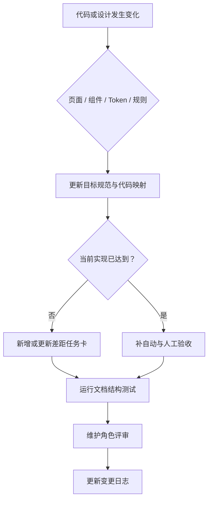

# 11 维护流程

> 文档编号：UI-11  
> 规范版本：1.1.0-draft<br>
> 状态：草案  
> 最后核对日期：2026-08-10<br>
> 适用提交：146819292<br>
> 维护角色：设计系统维护者  
> 相关文档：[总目录](README.md) · [差距台账](10_GAP_LEDGER.md) · [变更日志](CHANGELOG.md)

## 初学者解释

设计规范不是写完就不变的说明书。代码、依赖和页面会继续变化，因此每次新增页面、组件或 Token 时，都要同时更新对应档案和验收。维护流程的作用是让“代码事实”和“目标规则”不会悄悄分叉。

## 规范要求

### 新增或修改页面

1. 在 `BiliPaiNavKey` 新增 Key 时，先运行结构测试并确认它因缺少目录项而失败。
2. 在 `PAGE_CATALOG.md` 增加唯一登记：Key、路由、Screen/内容角色、母版、领域档案、状态与日期。
3. 在领域文档新增完整档案，填写 12 种状态；不适用项写原因。
4. 若页面需要新组件，先查组件目录；没有合适入口时提交组件提案。
5. 更新 Miuix 完整验收范围；若属于关键流程，同步兼容风格矩阵。

### 新增或修改组件

1. 用一句话定义语义，不以颜色、圆角或某页面命名。
2. 搜索是否已有同义入口，列出不能复用的具体原因。
3. 在组件档案填写用途、禁用场景、结构、变体、尺寸、Token、状态、交互、文案、无障碍、响应式、双主题映射、Compose 入口、差距和验收。
4. 公共组件进入 `design-system`；领域专用组件留在 feature 包并明确边界。
5. 新入口应有策略或结构测试；旧入口迁移前不得宣称“唯一入口已完成”。

### 新增 Token

Token 提案必须回答：现有 Token 为什么不能表达、至少哪些场景共享、MIUIX/Material 3 如何映射、旧硬编码怎样迁移、如何验证。单一页面的一次数值通常保持领域常量，而不是全局 Token。

### 规范变更

| 变更级别 | 例子 | 版本处理 |
|---|---|---|
| Patch | 修正文案、链接、代码映射 | `1.0.1` |
| Minor | 新增兼容规则、组件变体、页面母版 | `1.1.0` |
| Major | 改变主设计方向或公共语义合同 | `2.0.0` |

草案阶段保持 `1.0.0-draft`，首次人工评审完成后改为 `1.0.0`。任何规则改变都要更新 `CHANGELOG.md`；只更新“最后核对日期”不算版本变更。

### 评审合同

- **必须**区分当前实现与目标规范，不能把计划中的 API 写成已存在。
- **必须**更新受影响的组件、页面、验收和差距台账链接。
- **必须**运行 `UiDesignDocumentationStructureTest`。
- **应该**由对应维护角色复核：设计系统、页面、播放器或 QA。
- **禁止**把本地过程计划、组件 CSV、Agent 配置或 `.codegraph/` 链接进正式 Wiki。
- **禁止**为文档任务顺带修改 UI 行为。

## 维护流程图



## Compose 短示例

```kotlin
// 新组件先消费现有 Token；确认存在共享语义后才提议新增 Token。
Modifier.padding(
    horizontal = AppSpacingTokens.Large,
    vertical = AppSpacingTokens.Small
)
```

## 代码映射

- 设计系统模块：`design-system/`
- 导航清单：`BiliPaiNavKey.kt`
- 文档结构测试：`UiDesignDocumentationStructureTest.kt`
- UI 审计：`scripts/ui_architecture_audit.ps1`
- 正式 Wiki 入口：`docs/wiki/README.md`

## 当前差距

规范刚建立，尚无完整人工评审记录；“维护角色”目前是职责名称而不是具体人员。部分旧过程资料仍在本地且被忽略，这是有意边界。

## 验收方法

模拟增加一个临时 NavKey（不提交）：结构测试应提示缺少目录登记。再检查一个组件规则变更是否会同时触及组件档案、差距台账、验收和变更日志。

