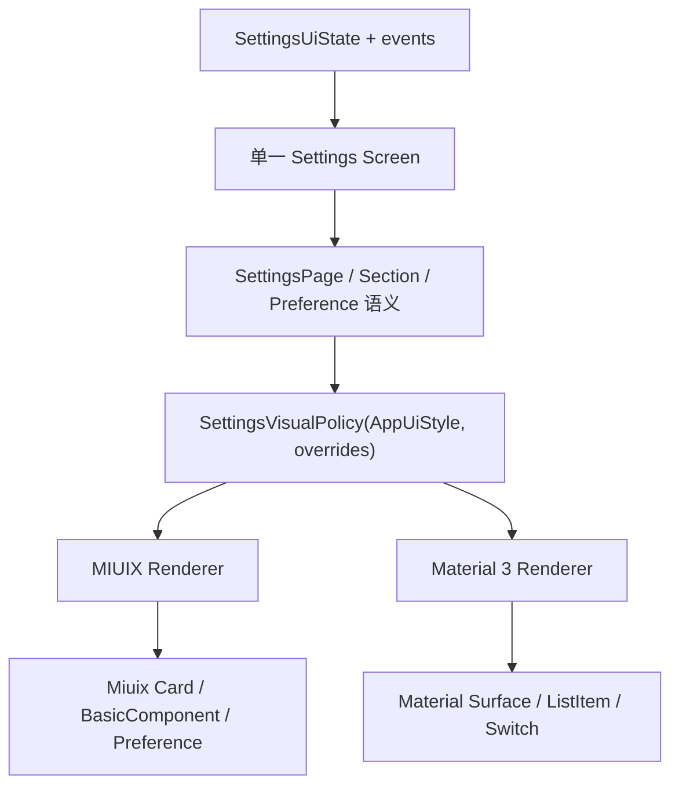

# 12 设置页 UI 优化计划

> 文档编号：UI-12<br>
> 规范版本：1.1.0-draft<br>
> 状态：草案<br>
> 最后核对日期：2026-08-10<br>
> 适用提交：146819292<br>
> 维护角色：设置维护者、设计系统维护者、QA 维护者<br>
> 相关文档：[设计方向](01_DIRECTION.md) · [主题规范](03_THEMES.md) · [设置页档案](pages/SETTINGS.md) · [差距台账](10_GAP_LEDGER.md)

## 初学者解释

本计划把设置页从“同一套扁平列表换主题色”改为“一套设置语义、两套官方视觉语法”。实施时先建立可测试的视觉策略，再改共享外壳，最后以外观页为试点逐步迁移，避免一次改动所有设置页面。

## 规范要求

- 每一阶段都必须可独立编译、测试和回滚。
- 业务状态、DataStore 键、导航和设置搜索定位不能因视觉改造改变。
- 不复制 MIUIX/Material 3 两份 Screen，不新增与 `AppPreference*` 同义的组件族。
- 先修默认/`AUTO` 路径；显式高级覆盖保留兼容，不在视觉任务中删除用户数据。
- 自动验证优先使用纯 Kotlin policy 和结构测试；设备视觉结果用文字记录。

## 输入证据

### 参考图结论

| 参考 | 可复用的设计原则 | 不应直接照抄 |
|---|---|---|
| Google Play / Material 3 | 弱色页面背景、大圆角分组、单色图标、紧凑行、组间留白 | 某个产品省略全部箭头的做法；BiliPai 应按动作语义决定 |
| 小米系统设置 / MIUIX | 居中标题、分组卡、彩色圆角图标、状态值与轻箭头、无组内分隔 | 系统设置没有说明文字，不代表复杂应用设置一律禁止说明 |
| BiliPai 当前 Material 3 | 已有 Material 标题、动态色与语义图标能力 | 扁平超长分组、重复当前值、过量常驻说明和上下双箭头 |
| BiliPai 当前 MIUIX | 已有居中标题、Miuix Switch 与彩色图标能力 | 正文仍沿用与 Material 相同的扁平大留白结构 |

### 代码证据

- `SettingsPageScaffold` 被约 16 个设置入口复用，统一改动具有明确收益，也有较大影响面。
- `SettingsPageScaffold` 当前强制 `LocalAppPreferenceGroupPresentation = FLAT` 与 `LocalAppPreferenceIconTreatment = FILLED`。
- `AppearanceSettingsScreen` 的“显示模式”从主题预设延伸到颜色、高级角色、语言和显示密度，依赖大量手工 Divider/Spacer。
- `AdaptivePreferenceComponents` 已具备 Miuix Card、BasicComponent、SwitchPreference 以及 Material Row/Switch 分发能力，可以补强而无需新建平行组件。
- `AppListItemStyle.AUTO` 当前为 Material 3 解析 `CUSTOM`、MIUIX 解析 `NATIVE`，与“两个主题默认均遵循官方设置行”目标不一致。

## 目标架构



建议的纯策略输出：

```kotlin
data class SettingsVisualPolicy(
    val groupPresentation: AppPreferenceGroupPresentation,
    val iconTreatment: AppPreferenceIconTreatment,
    val topBarPresentation: SettingsTopBarPresentation,
    val dividerMode: SettingsDividerMode,
    val contentWidth: SettingsContentWidth,
)
```

实际实现前应复用现有类型并控制 API 数量；这段代码只描述需要被测试的决策，不是要求原样新增全部枚举。

## 信息架构目标

外观页按用户任务重组为以下顺序：

1. **界面与明暗**：界面预设、跟随系统/浅色/深色、AMOLED 条件项。
2. **颜色**：壁纸取色/自定义色、颜色 swatch、必要的预览与重置。
3. **表面与效果**：液态玻璃、模糊和其他会影响可读性/性能的效果。
4. **文字与显示**：字体、字号、界面缩放、语言。
5. **高级外观覆盖**：图标样式、列表条目、单选呈现、高级颜色角色。

每个组优先包含 2-6 个同一任务的设置。复杂编辑器可以展开为组后内容或进入二级页面，但不能把整个外观页放进一个容器，也不能把常驻说明卡嵌在设置卡中。

## 实施阶段

### P0 规范基线

**状态**：本计划对应文档变更完成并通过结构测试后完成。

**工作**：

1. 统一 `ui-design` 中的“两主题”事实，iOS 只保留历史迁移说明。
2. 固化设置页主题映射、文案规则、参考图使用边界和验收矩阵。
3. 在差距台账登记设置页视觉策略与外观页信息架构任务。

**退出条件**：文档链接、版本头和双主题术语检查通过。

### P1 视觉策略与默认值

**建议修改入口**：

- `app/.../feature/settings/ui/SettingsPageScaffold.kt`
- 新增或扩展相邻的纯 Kotlin settings visual policy
- `design-system/.../AppSemanticVisualPolicy.kt`
- `design-system/.../AppListItemPolicy.kt`
- 对应 policy/structure tests

**工作**：

1. 用纯策略解析 MIUIX/Material 3 的 group、icon、top bar、divider 和宽度。
2. `AUTO/跟随预设` 在设置页解析为主题官方默认。
3. 评估 `AppListItemStyle.AUTO -> NATIVE` 的全局影响；若影响非设置业务列表，则把官方默认限制在 Preference 范围，不机械修改所有列表。
4. 保留显式 `CUSTOM/NATIVE` 和图标覆盖的持久化兼容。

**自动验证**：两主题策略参数、默认值、显式覆盖和非法值回退的纯 Kotlin 测试。

### P2 共享设置页外壳

**建议修改入口**：

- `SettingsPageScaffold.kt`
- `AppPreferenceComponents.kt`
- `AdaptivePreferenceComponents.kt`
- `AdaptiveChrome.kt` / `AppTopBar`

**工作**：

1. 删除 Scaffold 对 `FLAT/FILLED` 的无条件覆盖，改为消费 P1 策略。
2. MIUIX 使用居中标题、Miuix Card 和彩色 squircle 图标。
3. Material 3 使用 Material TopAppBar、分组 surface 和单色图标。
4. 统一内容最大宽度、屏幕边距、组间距和底部安全区。
5. 保留 External/LazyColumn 两种 scroll host，不改变搜索定位和滚动所有权。

**风险**：共享 Scaffold 影响设置搜索、权限、播放、插件、备份等约 16 个入口。必须先完成策略测试，再迁移试点。

### P3 外观页试点

**建议修改入口**：

- `AppearanceSettingsScreen.kt`
- `SettingsSelectionComponents.kt`
- 外观页相关 policy 与字符串资源

**工作**：

1. 按五组信息架构拆分超长“显示模式”组。
2. 标题不再拼接当前值；当前值只放 trailing、选中状态或选项弹层。
3. 把“安卓原生 · Material 3/MIUIX”常驻说明卡改为简短 supporting text、tooltip 或一次性说明。
4. 将图标、列表条目、单选呈现和高级角色编辑移到“高级外观覆盖”。
5. 颜色入口使用 swatch + 文本值；动态取色不可用时显示原因但不阻塞自定义色。
6. 说明最多承担一个影响或限制，默认不超过两行。

**自动验证**：信息架构顺序、搜索 focusId 到目标组的映射、主题切换不重置状态、文案不重复当前值。

### P4 其余设置页面

**顺序**：设置首页/分类 → 搜索 → 播放/动画/权限 → 插件/备份/长尾工具。

**工作**：

1. 迁移标准组和标准行，删除页面私有的等价 padding/divider。
2. 危险操作、外部链接、只读诊断和富编辑器保留明确领域变体。
3. 840dp 双栏中只保留一套顶部栏和一套详情表面。
4. 不在普通行中重复图标、当前值或组件实现说明。

### P5 验收与收尾

**自动矩阵**：

- `SettingsVisualPolicy` 纯 Kotlin 测试。
- `AdaptivePreference` 结构/策略测试。
- `SettingsSubpageChromeStructureTest` 与文档结构测试。
- `:design-system:compileDebugKotlin` 和 `:app:compileDebugKotlin`，按修改范围选择最小任务。

**人工矩阵**：

| 主题 | 宽度/模式 | 最小范围 |
|---|---|---|
| MIUIX | 360dp 浅/深/AMOLED | 设置首页、外观、播放、权限、搜索 |
| MIUIX | 840dp 浅/深 | 双栏、切分类、返回、滚动状态 |
| Material 3 | 360dp 浅/深 | 与 MIUIX 相同页面和设置项 |
| Material 3 | 840dp 浅/深 | 双栏和长文案 |

设备记录只写环境、步骤、预期和实际结果，不要求截图。

## 里程碑与提交边界

| 里程碑 | 可独立提交内容 | 不应混入 |
|---|---|---|
| M0 | 规范、计划、文档测试 | 生产 UI 行为 |
| M1 | SettingsVisualPolicy 与单测 | 页面重排 |
| M2 | Scaffold 和 adaptive primitives | 外观页业务状态改造 |
| M3 | 外观页信息架构 | 其他设置页批量迁移 |
| M4 | 每批 2-4 个设置页面 | 无关页面重构 |
| M5 | 验收修复与文档收尾 | 新功能 |

## 代码映射

- 设置页共享外壳：`SettingsPageScaffold.kt`
- 外观页：`AppearanceSettingsScreen.kt`
- 公共 Preference：`AppPreferenceComponents.kt`
- 主题 Renderer：`AdaptivePreferenceComponents.kt`
- 图标策略：`AppSemanticVisualPolicy.kt`
- 列表策略：`AppListItemPolicy.kt`
- 结构测试：`SettingsSubpageChromeStructureTest.kt`、`AdaptiveGroupSurfaceShapeStructureTest.kt`

## 当前差距

P0 之外尚未修改生产 UI。现有实现具备双主题状态和底层组件能力，但 shared Scaffold、默认 Preference 策略、外观页信息架构与双主题验收证据仍未达到本计划目标。

## 验收方法

每个阶段必须满足自己的退出条件，并在差距台账更新状态。只有当默认路径、显式高级覆盖、两主题、明暗模式、360/840dp、搜索定位和状态持久化均有证据时，设置页优化才能标为完成。
