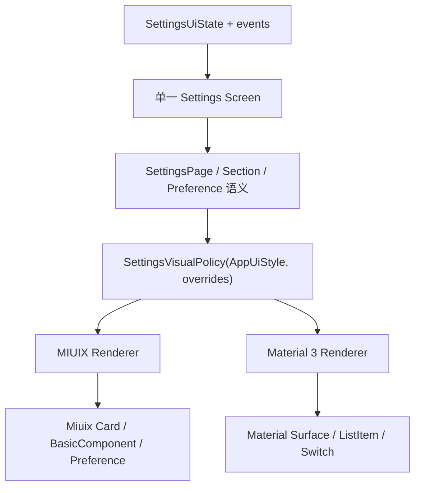

# 12 设置页 UI 优化计划

> 文档编号：UI-12<br>
> 规范版本：1.4.0-draft<br>
> 状态：草案<br>
> 最后核对日期：2026-08-10<br>
> 适用提交：4d4e93310<br>
> 维护角色：设置维护者、设计系统维护者、QA 维护者<br>
> 相关文档：[设计方向](01_DIRECTION.md) · [主题规范](03_THEMES.md) · [设置页档案](pages/SETTINGS.md) · [差距台账](10_GAP_LEDGER.md) · [变更日志](CHANGELOG.md)

## 修订记录

| 版本 | 日期 | 修订内容 | 依据 |
|---|---|---|---|
| 1.1.0-draft | 2026-08-10 | 首版：设置页双主题视觉合同与分阶段计划 | 双主题规范统一 |
| 1.2.0-draft | 2026-08-10 | 评审修订：澄清目标架构、补齐搜索定位/平板/首页设置联动/恢复语义/验收缺口；P4 显式延期 | 评审结论与决策记录 |
| 1.3.0-draft | 2026-08-10 | P1 视觉策略与 P2 共享外壳落地；顶部栏能力确认结论登记（Miuix 原生居中标题，无需新增适配器） | M1/M2 里程碑 |
| 1.4.0-draft | 2026-08-10 | P3 外观页试点落地：五组信息架构、稳定 key 搜索定位、标题去当前值、说明卡降级（D3）、恢复主题推荐（D2） | M3 里程碑 |

## 初学者解释

本计划把设置页从“同一套扁平列表换主题色”改为“一套设置语义、两套官方视觉语法”。实施时先建立可测试的视觉策略，再改共享外壳，最后以外观页为试点逐步迁移，避免一次改动所有设置页面。

**本计划中的“目标架构”是逐步收敛的方向，不是当前代码的事实**：仓库现在没有统一的 `SettingsUiState` 或单一 Settings Screen，各设置页是独立 Screen + 各自 ViewModel/Store。实施时禁止为满足目标架构图新建全局状态层或统一 MVI 框架，只能在现有独立 Screen、ViewModel、`AppPreference*` 语义与纯 Policy 上渐进改造。

## 规范要求

- 每一阶段都必须可独立编译、测试和回滚。
- 业务状态、DataStore 键、导航和设置搜索定位不能因视觉改造改变。
- 不复制 MIUIX/Material 3 两份 Screen，不新增与 `AppPreference*` 同义的组件族。
- 先修默认/`AUTO` 路径；显式高级覆盖保留兼容，不在视觉任务中删除用户数据。
- 自动验证优先使用纯 Kotlin policy 和结构测试；设备视觉结果用文字记录。

## 输入证据

### 参考图结论

| 参考 | 可复用的设计原则 | 不应直接照抄 |
|---|---|---|
| Google Play / Material 3 | 弱色页面背景、大圆角分组、单色图标、紧凑行、组间留白 | 某个产品省略全部箭头的做法；BiliPai 应按动作语义决定 |
| 小米系统设置 / MIUIX | 居中标题、分组卡、彩色圆角图标、状态值与轻箭头、无组内分隔 | 系统设置没有说明文字，不代表复杂应用设置一律禁止说明 |
| BiliPai 当前 Material 3 | 已有 Material 标题、动态色与语义图标能力 | 扁平超长分组、重复当前值、过量常驻说明和上下双箭头 |
| BiliPai 当前 MIUIX | 已有居中标题、Miuix Switch 与彩色图标能力 | 正文仍沿用与 Material 相同的扁平大留白结构 |

### 代码证据

- `SettingsPageScaffold` 被约 16 个设置入口复用，统一改动具有明确收益，也有较大影响面。
- `SettingsPageScaffold` 当前强制 `LocalAppPreferenceGroupPresentation = FLAT` 与 `LocalAppPreferenceIconTreatment = FILLED`。
- `AppearanceSettingsScreen` 的“显示模式”从主题预设延伸到颜色、高级角色、语言和显示密度，依赖大量手工 Divider/Spacer。
- `AdaptivePreferenceComponents` 已具备 Miuix Card、BasicComponent、SwitchPreference 以及 Material Row/Switch 分发能力，可以补强而无需新建平行组件。
- `AppListItemStyle.AUTO` 当前为 Material 3 解析 `CUSTOM`、MIUIX 解析 `NATIVE`，与“两个主题默认均遵循官方设置行”目标不一致。

## 目标架构

> 该图只描述最终收敛方向。当前不存在统一的 SettingsUiState 与单一 Screen；实现时必须复用现有独立 Screen、ViewModel 和 Policy，不得为满足此图新增全局状态层。



建议的纯策略输出：

```kotlin
data class SettingsVisualPolicy(
    val groupPresentation: AppPreferenceGroupPresentation,
    val iconTreatment: AppPreferenceIconTreatment,
    val topBarPresentation: SettingsTopBarPresentation,
    val dividerMode: SettingsDividerMode,
    val contentWidth: SettingsContentWidth,
)
```

实际实现前应复用现有类型并控制 API 数量；这段代码只描述需要被测试的决策，不是要求原样新增全部枚举。

## 信息架构目标

外观页按用户任务重组为以下顺序：

1. **界面与明暗**：界面预设、跟随系统/浅色/深色、AMOLED 条件项。
2. **颜色**：壁纸取色/自定义色、颜色 swatch、必要的预览与重置。
3. **表面与效果**：液态玻璃、模糊和其他会影响可读性/性能的效果。
4. **文字与显示**：字体、字号、界面缩放、语言。
5. **高级外观覆盖**：图标样式、列表条目、单选呈现、高级颜色角色。

每个组优先包含 2-6 个同一任务的设置。复杂编辑器可以展开为组后内容或进入二级页面，但不能把整个外观页放进一个容器，也不能把常驻说明卡嵌在设置卡中。

## 实施阶段

### P0 规范基线

**状态**：本计划对应文档变更完成并通过结构测试后完成。

**工作**：

1. 统一 `ui-design` 中的“两主题”事实，iOS 只保留历史迁移说明。
2. 固化设置页主题映射、文案规则、参考图使用边界和验收矩阵。
3. 在差距台账登记设置页视觉策略与外观页信息架构任务。

**退出条件**：文档链接、版本头和双主题术语检查通过。

### P1 视觉策略与默认值

**状态**：已完成（commit 933cf5d5f）。`SettingsVisualPolicy` 纯策略 + 7 条单测（两主题参数/默认值/显式覆盖/非法值回退/非设置列表 AUTO 回归）全部通过。

**建议修改入口**：

- `app/.../feature/settings/ui/SettingsPageScaffold.kt`
- 新增或扩展相邻的纯 Kotlin settings visual policy
- `design-system/.../AppSemanticVisualPolicy.kt`
- `design-system/.../AppListItemPolicy.kt`
- 对应 policy/structure tests

**工作**：

1. 用纯策略解析 MIUIX/Material 3 的 group、icon、top bar、divider 和宽度。
2. `AUTO/跟随预设` 在设置页解析为主题官方默认。
3. 评估 `AppListItemStyle.AUTO -> NATIVE` 的全局影响；若影响非设置业务列表，则把官方默认限制在 Preference 范围，不机械修改所有列表。
4. 保留显式 `CUSTOM/NATIVE` 和图标覆盖的持久化兼容。
5. 必须新增一条“设置页之外 `AppListItemStyle.AUTO` 行为不变”的回归测试，把影响面锁死；不得只靠评审口头评估。

**自动验证**：两主题策略参数、默认值、显式覆盖和非法值回退的纯 Kotlin 测试；非设置列表 AUTO 语义不变的回归测试。

### P2 共享设置页外壳

**状态**：已完成（commit ac9b7d237）。Scaffold 消费策略、顶部栏能力确认与双栏面板契约均已落地；`SettingsSubpageChromeStructureTest` 新增契约测试通过。

**建议修改入口**：

- `SettingsPageScaffold.kt`
- `AppPreferenceComponents.kt`
- `AdaptivePreferenceComponents.kt`
- `AdaptiveChrome.kt` / `AppTopBar`
- `SettingsTabletShell.kt` / 双栏详情面板契约

**工作**：

1. 删除 Scaffold 对 `FLAT/FILLED` 的无条件覆盖，改为消费 P1 策略。
2. MIUIX 使用居中标题、Miuix Card 和彩色 squircle 图标。
3. Material 3 使用 Material TopAppBar、分组 surface 和单色图标。
4. 统一内容最大宽度、屏幕边距、组间距和底部安全区。
5. 保留 External/LazyColumn 两种 scroll host，不改变搜索定位和滚动所有权。
6. **顶部栏能力确认（capability spike，已完成）**：`AppTopBarStyle.CENTERED` 在 MIUIX 分支与 `SMALL` 渲染同一 `MiuixSmallTopAppBar`。经 miuix 0.9.3 源码与 SNAPSHOT aar 字节码双重确认：Miuix `SmallTopAppBar`/`TopAppBar` 标题布局原生居中（`(maxWidth - titleWidth) / 2`，在导航与操作图标之间居中）。**”MIUIX 居中标题”由现状 SMALL 路径直接达成——同渲染不是能力缺口，而是 Miuix 官方语法本身**；无需在 design-system 新增受控适配器。策略中 MIUIX → `CENTERED` 表达合同意图，渲染层统一由 `MiuixSmallTopAppBar` 承担。
7. **840dp 双栏顶部栏契约**：子页面 Screen 在 `SettingsTabletShell` 的详情面板（`rightPane`）内仍渲染自身 `SettingsPageScaffold` 顶栏，双顶栏由此而来。策略需要感知“是否处于双栏详情面板”：详情面板内抑制/降级 Scaffold 顶栏，仅保留一套顶部栏和一套详情表面。

**风险**：共享 Scaffold 影响设置搜索、权限、播放、插件、备份等约 16 个入口；`SettingsTabletShell` 不消费 Scaffold，需通过策略或面板上下文联动，不能只改壳。必须先完成策略测试，再迁移试点。

### P3 外观页试点

**状态**：已完成（commit 4d4e93310）。五组信息架构、稳定 key 搜索定位、标题去当前值、说明卡降级（D3）与恢复主题推荐（D2）均已落地；新增信息架构结构测试与 focus key 单测通过，受组名影响的既有测试已同步更新。

**建议修改入口**：

- `AppearanceSettingsScreen.kt`（含 `AppearanceSettingsContentMode.HOME` 共享路径）
- `SettingsSelectionComponents.kt`
- `SettingsSearchFocusPolicy.kt`（搜索定位映射）
- 外观页相关 policy 与字符串资源

**P3 前置条件（必须先行完成并测试）**：

- 保持既有 focusId 字符串与搜索语义不变；将外观页搜索定位从固定 LazyColumn 位置索引改为“focusId → 稳定行/组 key”的声明式映射，滚动时按 key 求当前 index 定位。
- 条件项显隐、`HOME` 内容模式和 840dp 双栏详情面板下都必须定位到同一语义目标。
- 不得在重组后继续维护新的硬编码索引表。

**工作**：

1. 按五组信息架构拆分超长“显示模式”组。
2. 标题不再拼接当前值；当前值只放 trailing、选中状态或选项弹层。
3. 把“安卓原生 · Material 3/MIUIX”常驻说明卡降级为简短 supporting text 或问号提示（tooltip/一次性说明），保留关键信息但不占视觉层级（见决策记录 D3）。
4. 将图标、列表条目、单选呈现和高级角色编辑移到“高级外观覆盖”。
5. 颜色入口使用 swatch + 文本值；动态取色不可用时显示原因但不阻塞自定义色。
6. 说明最多承担一个影响或限制，默认不超过两行。
7. **首页设置联动**：`HomeSettingsScreen` 复用本 Screen（`contentMode = HOME`），五组重组、说明卡降级和 trailing 改动会同时作用于首页设置页；`HOME_OVERVIEW` 定位与 `resolveHomeSettingsScrollIndex` 必须纳入同样验证，不得只验收外观模式。

**自动验证**：信息架构顺序、搜索 focusId 到目标组的稳定 key 映射（含条件项/Home/双栏三场景）、主题切换不重置状态、文案不重复当前值。

### P4 其余设置页面（本次范围外，显式延期）

**状态**：本阶段不在当前评审修订后的执行范围内；P1-P3 全部验证通过后另行开任务。

**顺序**：设置首页/分类 → 搜索 → 播放/动画/权限 → 插件/备份/长尾工具。

**工作**：

1. 迁移标准组和标准行，删除页面私有的等价 padding/divider。
2. 危险操作、外部链接、只读诊断和富编辑器保留明确领域变体。
3. 840dp 双栏中只保留一套顶部栏和一套详情表面（消费 P2 的面板契约）。
4. 不在普通行中重复图标、当前值或组件实现说明。

### P5 验收与收尾

**自动矩阵**：

- `SettingsVisualPolicy` 纯 Kotlin 测试。
- `AdaptivePreference` 结构/策略测试。
- `SettingsSubpageChromeStructureTest` 与文档结构测试。
- `:design-system:compileDebugKotlin` 和 `:app:compileDebugKotlin`，按修改范围选择最小任务。
- 非设置列表 `AppListItemStyle.AUTO` 行为不变的回归测试。

**前置环境检查**：P1 开工前确认 GitHub Packages 的 MIUIX SNAPSHOT 依赖可解析（`compileDebugKotlin` 可成功拉取）；若返回 401，属于依赖认证问题，需先解决或记录阻塞，不得把该失败当作产品测试结果。

**人工矩阵**：

| 主题 | 宽度/模式 | 最小范围 |
|---|---|---|
| MIUIX | 360dp 浅/深/AMOLED | 设置首页、外观、播放、权限、搜索 |
| MIUIX | 840dp 浅/深 | 双栏、切分类、返回、滚动状态、详情面板仅一套顶栏 |
| Material 3 | 360dp 浅/深 | 与 MIUIX 相同页面和设置项 |
| Material 3 | 840dp 浅/深 | 双栏和长文案、深色 `surfaceContainer` 分组层级 |

设备记录只写环境、步骤、预期和实际结果，不要求截图。

**无障碍补项**：两主题抽读屏（TalkBack）检查外观页与搜索定位——读出标题、开关状态、当前值、禁用原因和选中分类，不只靠颜色表达状态。

## 里程碑与提交边界

| 里程碑 | 可独立提交内容 | 不应混入 |
|---|---|---|
| M0 | 规范、计划、文档测试 | 生产 UI 行为 |
| M1 | SettingsVisualPolicy 与单测（已完成） | 页面重排 |
| M2 | Scaffold 和 adaptive primitives（已完成） | 外观页业务状态改造 |
| M3 | 外观页信息架构（已完成） | 其他设置页批量迁移 |
| M4 | 每批 2-4 个设置页面 | 无关页面重构 |
| M5 | 验收修复与文档收尾 | 新功能 |

## 决策记录

评审修订时由产品方拍板的决定，实施与验收必须遵守：

| 编号 | 决策 | 内容 |
|---|---|---|
| D1 | 执行范围 | 本次只做 P1-P3（视觉策略、共享外壳、外观页试点）；P4 批量迁移显式延期，P1-P3 验证通过后另行开任务 |
| D2 | 恢复主题推荐的语义 | “恢复主题推荐”是用户主动操作：仅清除视觉覆盖字段（图标样式、列表条目样式、单选呈现、高级颜色角色）并恢复 `AUTO`，不改变主题选择、明暗模式、语言、字号等业务偏好；主题切换绝不清除用户显式覆盖 |
| D3 | 说明卡去向 | 外观页“界面预设”说明卡降级为小字说明或问号提示（tooltip/一次性说明），保留关键信息但不占视觉层级 |
| D4 | 顶部栏目标 | 两主题分别使用官方顶部栏语法（MIUIX 居中标题 + 充足顶部留白、Material TopAppBar）；在未确认 Miuix 现有能力前不假定可枚举切换 |

## 代码映射

- 设置页共享外壳：`SettingsPageScaffold.kt`
- 外观页：`AppearanceSettingsScreen.kt`
- 公共 Preference：`AppPreferenceComponents.kt`
- 主题 Renderer：`AdaptivePreferenceComponents.kt`
- 图标策略：`AppSemanticVisualPolicy.kt`
- 列表策略：`AppListItemPolicy.kt`
- 结构测试：`SettingsSubpageChromeStructureTest.kt`、`AdaptiveGroupSurfaceShapeStructureTest.kt`

## 当前差距

P0-P3 已落地：规范基线、`SettingsVisualPolicy` 纯策略、共享设置页外壳（含双栏单顶栏契约与顶部栏能力确认）与外观页五组信息架构试点均已完成并通过策略/结构测试（含非设置列表 `AUTO` 回归、稳定 key 搜索定位三场景、信息架构顺序与文案不重复当前值）。剩余差距：其余设置页批量迁移（P4，显式延期）与双主题人工验收矩阵（P5，含 TalkBack 抽读屏）。P1-P3 为本轮执行范围，P4 已显式延期。

## 验收方法

每个阶段必须满足自己的退出条件，并在差距台账更新状态。P1-P3 全部通过后：默认路径、显式高级覆盖（D2 语义）、两主题、明暗模式、360/840dp（含详情面板单顶栏）、稳定 key 搜索定位（含条件项/HOME/双栏三场景）和状态持久化均有证据时，外观页试点才能标为完成；P4 另行开任务。
