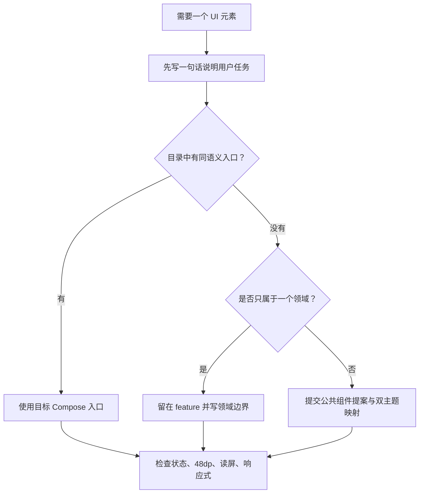

# UI 组件目录

> 文档编号：UI-COMP-INDEX  
> 规范版本：1.0.0-draft  
> 状态：草案  
> 最后核对日期：2026-08-02  
> 适用提交：4443e72ff  
> 维护角色：设计系统维护者  
> 相关文档：[总目录](../README.md) · [基础令牌](../02_FOUNDATIONS.md) · [差距台账](../10_GAP_LEDGER.md)

## 初学者解释

组件是可以重复使用的一段界面和行为。判断两个东西是否是同一个组件，要先看“用途”而不是外观：粉色确认按钮和灰色确认按钮仍可能是同一个“主操作”；视频的点赞计数与弹窗的确认按钮虽然都能点击，却不是同一语义。

## 选择流程



## 规范要求

- **必须**优先使用下表的目标入口；标为“目标待建”的入口不可假装当前已存在。
- **必须**让公共组件位于 `design-system`，仅业务领域可理解的组件位于对应 feature。
- **应该**让组件接收不可变状态与事件 lambda，不把 ViewModel 传入叶子组件。
- **禁止**因某页需要不同颜色就复制整个组件；先增加有语义的变体。
- **禁止**把不同语义仅因长得相似而强行合并。

## 唯一目标入口登记

下表是目标入口的唯一登记位置。自动测试会检查“目标 Compose 入口”不重复。

| ID | 语义 | 目标 Compose 入口 | 当前状态 | 详细规范 |
|---|---|---|---|---|
| C001 | 文本 | `AppText` | 已存在 | [基础原语](PRIMITIVES.md) |
| C002 | 图标 | `AppIcon` | 已存在 | [基础原语](PRIMITIVES.md) |
| C003 | 语义表面 | `AppSurface` | 已存在 | [基础原语](PRIMITIVES.md) |
| C004 | 页面主操作 | `AppPrimaryButton` | 已存在 | [基础原语](PRIMITIVES.md) |
| C005 | 一般按钮 | `AppButton` | 已存在 | [基础原语](PRIMITIVES.md) |
| C006 | 图标按钮 | `AppIconButton` | 已存在 | [基础原语](PRIMITIVES.md) |
| C007 | 内容卡片 | `AppCard` | 已存在 | [基础原语](PRIMITIVES.md) |
| C008 | 分隔线 | `AppHorizontalDivider` | 已存在 | [基础原语](PRIMITIVES.md) |
| C009 | 不确定加载 | `AdaptiveLoadingIndicator` | 已存在 | [基础原语](PRIMITIVES.md) |
| C101 | 搜索输入 | `AppSearchField` | 已存在 | [输入与选择](INPUT_SELECTION.md) |
| C102 | 普通文本输入 | `AppTextField` | 已存在 | [输入与选择](INPUT_SELECTION.md) |
| C103 | 二元偏好 | `AppSwitchPreference` | 已存在 | [输入与选择](INPUT_SELECTION.md) |
| C104 | 连续数值偏好 | `AppSliderPreference` | 已存在 | [输入与选择](INPUT_SELECTION.md) |
| C105 | 设置入口/选项 | `AppPreference` | 已存在 | [输入与选择](INPUT_SELECTION.md) |
| C106 | 设置分组 | `AppPreferenceGroup` | 已存在 | [输入与选择](INPUT_SELECTION.md) |
| C201 | 页面外壳 | `AppScaffold` | 已存在 | [导航与外壳](NAVIGATION_CHROME.md) |
| C202 | 页面顶部栏 | `AppTopBar` | 已存在 | [导航与外壳](NAVIGATION_CHROME.md) |
| C203 | 主底部导航宿主 | `AppBottomNavigationHost` | 已存在 | [导航与外壳](NAVIGATION_CHROME.md) |
| C204 | 导航栏 | `AppNavigationBar` | 已存在 | [导航与外壳](NAVIGATION_CHROME.md) |
| C205 | 侧边导航 | `AppPlatformNavigationRail` | 已存在 | [导航与外壳](NAVIGATION_CHROME.md) |
| C206 | 分段页签 | `AppScrollableTabRow` | 已存在 | [导航与外壳](NAVIGATION_CHROME.md) |
| C207 | 列表-详情分栏 | `AppAdaptiveSplitLayout` | 已存在 | [导航与外壳](NAVIGATION_CHROME.md) |
| C301 | 标准列表项 | `AppListItem` | 已存在 | [卡片与身份](CARDS_LISTS_IDENTITY.md) |
| C302 | 用户等级 | `UserLevelBadge` | 已存在 | [卡片与身份](CARDS_LISTS_IDENTITY.md) |
| C303 | 内容卡面策略 | `ContentCardSurfacePolicy` | 已存在 | [卡片与身份](CARDS_LISTS_IDENTITY.md) |
| C401 | 确认/警告对话框 | `AppAlertDialog` | 已存在 | [弹层与反馈](OVERLAYS_FEEDBACK.md) |
| C402 | 底部面板 | `AppModalBottomSheet` | 已存在 | [弹层与反馈](OVERLAYS_FEEDBACK.md) |
| C403 | 短暂反馈 | `AppSnackbar` | 已存在 | [弹层与反馈](OVERLAYS_FEEDBACK.md) |
| C404 | 选项菜单 | `AppDropdownMenu` | 已存在 | [弹层与反馈](OVERLAYS_FEEDBACK.md) |
| C405 | 错误状态 | `AppErrorState` | 已存在 | [弹层与反馈](OVERLAYS_FEEDBACK.md) |
| C406 | 空内容状态 | `AppEmptyState` | 已存在 | [弹层与反馈](OVERLAYS_FEEDBACK.md) |
| C501 | 播放器设置面板 | `VideoSettingsPanel` | 已存在 | [媒体与播放器](MEDIA_PLAYER.md) |
| C502 | 视频分 P 选择 | `video.ui.components.PagesSelector` | 目标收口 | [媒体与播放器](MEDIA_PLAYER.md) |
| C503 | 迷你播放器壳 | `MiniPlayerOverlay` | 已存在 | [媒体与播放器](MEDIA_PLAYER.md) |
| C504 | 播放器操作按钮 | `PlayerActionButton` | 目标待建 | [媒体与播放器](MEDIA_PLAYER.md) |
| C505 | 播放状态反馈层 | `PlayerStatusOverlay` | 目标待建 | [媒体与播放器](MEDIA_PLAYER.md) |

## 组件档案固定字段

每个组件必须说明：用途、禁用场景、组成结构、变体、尺寸、Token、状态、交互、文案、无障碍、响应式、双主题映射、Compose 入口、当前差距和验收。

## Compose 短示例

```kotlin
AppPrimaryButton(
    text = "保存",
    enabled = canSave,
    onClick = onSave
)
```

## 代码映射

- 公共原语：`AppPrimitiveComponents.kt`
- Preference：`AppPreferenceComponents.kt`
- 外壳：`AdaptiveChrome.kt`、`AppNavigationComponents.kt`
- 弹层：`AppDialogComponents.kt`、`AppSheetComponents.kt`
- 业务共享组件：`app/src/main/java/com/android/purebilibili/core/ui/components/`

## 当前差距

`ActionButton`、`GlassCard`、`ErrorState`、`LevelTag`、`PagesSelector` 等语义仍存在重复。目录中的“目标待建/目标收口”必须先完成[差距任务卡](../10_GAP_LEDGER.md)，不能直接删除旧实现。

## 验收方法

新组件评审时先在本目录找到唯一入口，再按对应档案检查所有状态、双主题、48dp 触摸区、字体放大和宽度变化。找不到入口时，先补文档提案而不是复制相近组件。

